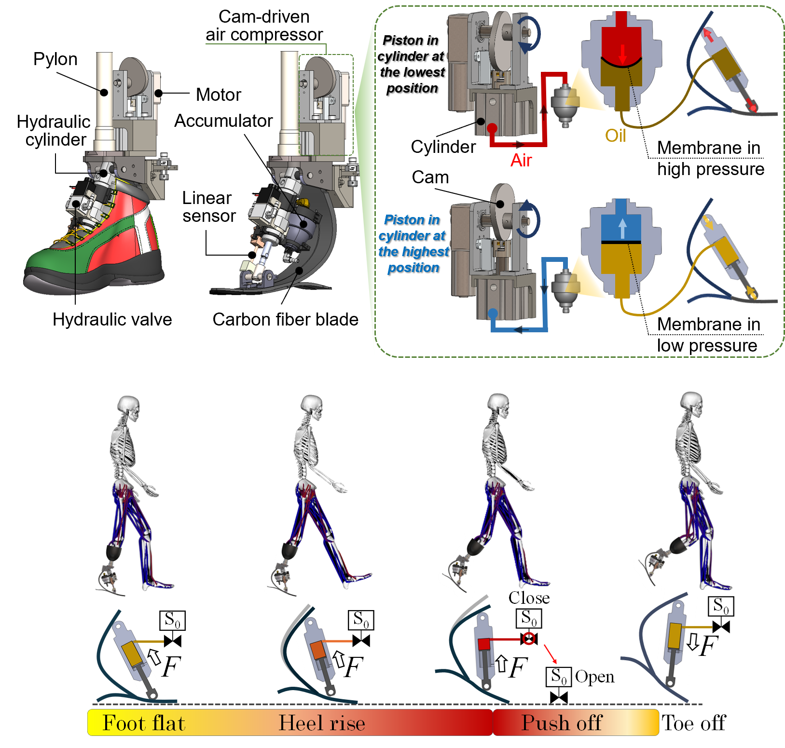
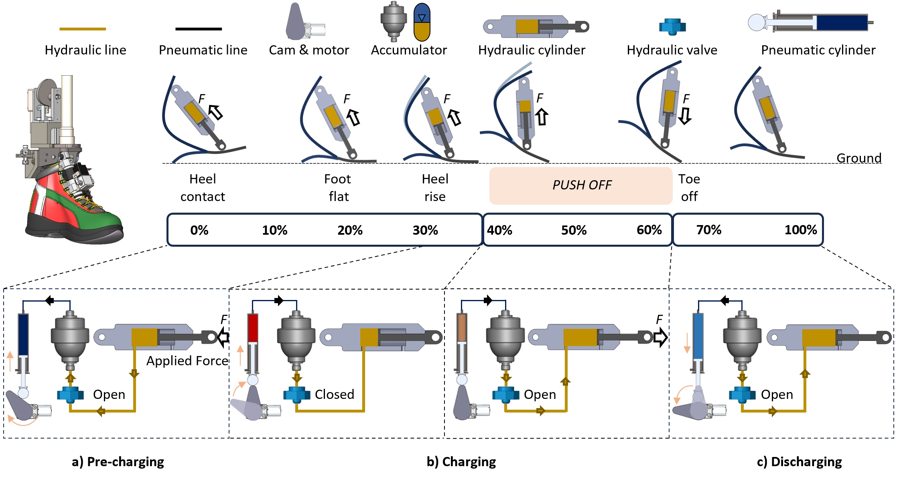
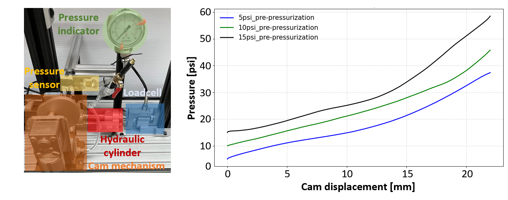
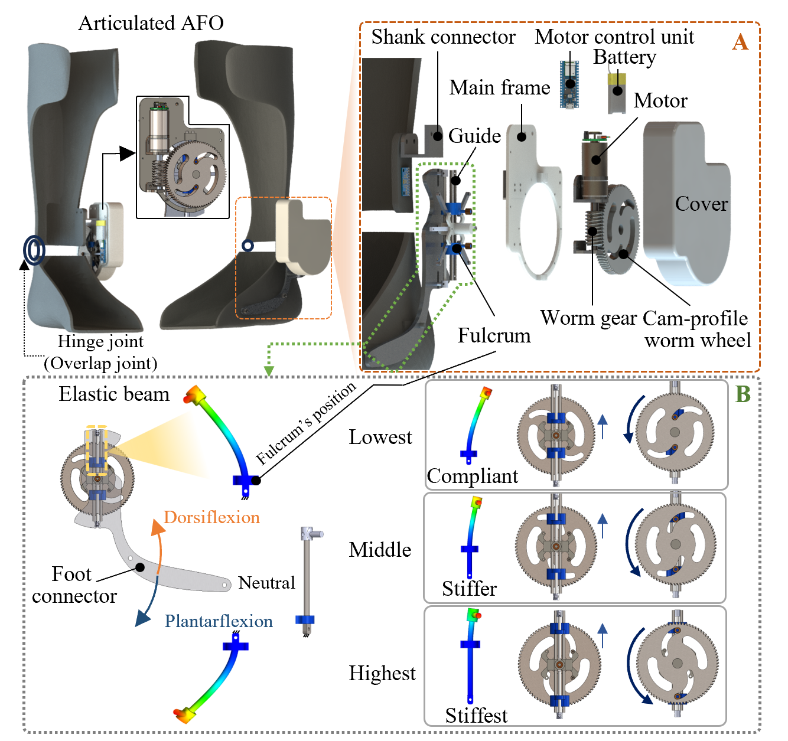
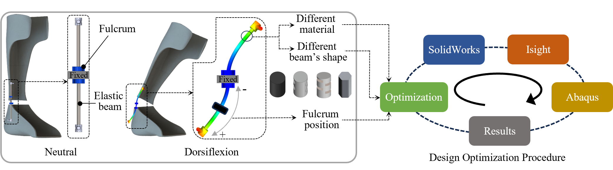
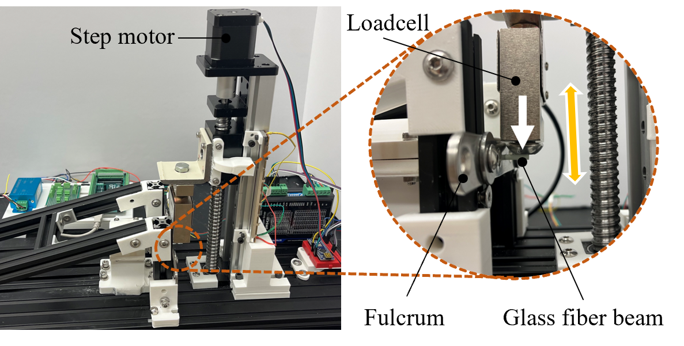

<h1 style="text-align:center; margin-top:20px;">
    Active Ankle‑Foot Prosthesis and Ankle Foot Orthoses 
  <a href="https://drive.google.com/file/d/1lzHS7XQuP3Iwwl6x3N6ibAXzu1Hojiy1/view?usp=sharing" target="_blank" style="font-size:18px; margin-left:10px;">
               [Patent : US 20260047945 A1]
  </a>
</h1>

<!-- 

  <strong>Patents:</strong> 
  <a href="https://drive.google.com/file/d/15kw3W2L4f25sP7ZtVakD1lRM0ncDsPn9/view?usp=sharing" target="_blank">US 20260047950 A1</a> 
  <a href="https://drive.google.com/file/d/1lzHS7XQuP3Iwwl6x3N6ibAXzu1Hojiy1/view?usp=sharing" target="_blank">US 20260047945 A1</a>

 -->

## Role

Lead designer and system developer — responsible for mechanical design of the hybrid pneumatic–hydraulic ankle joint, stiffness‑modulation strategy, gait‑phase timing control, embedded sensing, and full benchtop + human‑in‑the‑loop validation.

  
## Innovation

The objective of this design initiative is to create a compact, lightweight, and energy-efficient active ankle prosthesis that dynamically adjusts ankle joint stiffness and optimizes energy return while walking. Our innovative pneumatic and hydraulic hybrid system leverages the incompressible characteristics of fluid to effectively store and release energy for push-off support, while utilizing the compressible nature of air to provide variable stiffness for the user.

This approach presents several significant advantages:

<strong>1) Rapid Response:</strong> The mechanism facilitates quick stiffness modulation and provides additional energy within milliseconds, maintaining a compact and lightweight design. This design strategy effectively minimizes the energy consumption of the prosthesis while facilitating various movement transitions between different activities, thereby offering significant benefits for prosthesis users in real-life situations.

<strong>2) Energy Efficient:</strong> The prosthesis is designed to be energy efficient, utilizing a hydraulic mechanism that effectively captures the substantial elastic energy of the carbon fiber blade through simple operation of a valve, either opening or closing it as needed. The proposed design effectively streamlines the system by removing unnecessary power sources and control mechanisms for energy return timing. This optimization leads to a reduction in overall size, decreased battery requirements, and minimized energy consumption, thereby enhancing the potential for extended use.

<strong>3) Modular and Versatile Design:</strong> The device features a modular design that facilitates easy integration with various stiffness levels of prosthetic foot blades, allowing for quick exchanges between carbon fiber blades to achieve personalized stiffness adjustments.

  
  

    Overall design 
  

  
  

    The working principle of a system
  

  
  

    Bench testing of acttive prosthesis
  

<h1 style="text-align:center; margin-top:20px;">
    Semi‑Active AFO with Expandable Elastic‑Beam Mechanism
  <a href="https://drive.google.com/file/d/15kw3W2L4f25sP7ZtVakD1lRM0ncDsPn9/view?usp=sharing" target="_blank" style="font-size:18px; margin-left:10px;">
    [Patent : US 20260047950 A1]
  </a>
</h1>

## Innovation

This project introduces a semi‑active ankle–foot orthosis (AFO) that is lightweight, compact, and capable of rapid stiffness adjustment with minimal energy consumption. The core innovation lies in an expandable elastic‑beam mechanism whose rigidity can be tuned by selecting different beam types. The modular design allows quick replacement of the elastic beam, enabling a wide stiffness range suitable for both children and adults. A single AFO can also integrate multiple beam configurations when needed, providing customizable support for diverse gait requirements.

  
  

    Overall design
  

  
  

    Beam design based on machine leanring optimization
  

  
  

    Experiment setup for measuring the level of stiffness with different fulcrum positions
  

