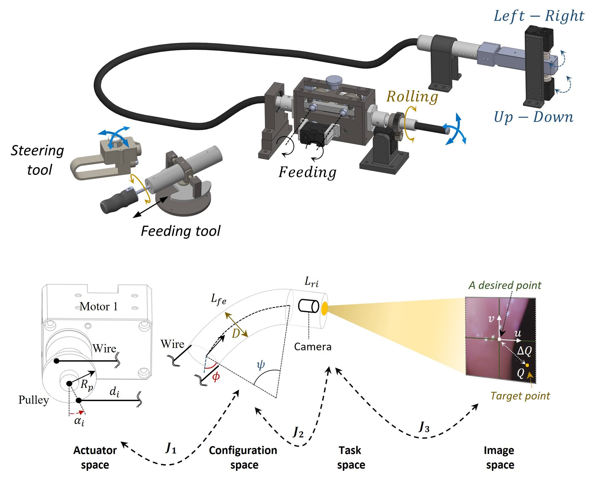

<h1 style="text-align:center; margin-top:20px;">
  <a href="https://drive.google.com/file/d/1HF4oMZRoWp-EF_oPysVArvt5hySrX4l2/view"
     target="_blank"
     style="text-decoration:none; color:inherit;">
    An End‑to‑End Learning‑Based Control Signal Prediction for Autonomous Robotic Colonoscopy
  </a>
</h1>

## Role
Lead designer and system developer — responsible for robotic mechanism design (feeding + steering), data collection, deep learning model development, control algorithm design, and full experimental validation on a colonoscopy training simulator.

---

## Overview
This project presents a **3‑DOF autonomous robotic colonoscopy system (ARCS)** capable of performing insertion, up–down, and left–right steering motions while operating within the mechanical limits of a conventional flexible colonoscope.

The system integrates:

- A **3‑DOF robotic colonoscopy mechanism** (feeding + tendon‑driven steering)
- **Image‑Based Visual Servo (IBVS)** for visual guidance
- **Deep learning models** for steering point prediction, collision probability, and full control signal generation
- A **control algorithm** for safe navigation and collision avoidance
- A **Colonoscopy Training Simulator (CTS)** for data collection and evaluation

The final end‑to‑end model achieved **shorter intubation time**, **higher success rate**, and **reduced operator workload** compared to joystick‑controlled human operation.

---

## System Summary

### **Robotic Hardware**
- **Feeding mechanism:** 4‑roller design for stable insertion, adjustable compression spring, <15 N insertion force  
- **Steering mechanism:** tendon‑driven, two‑motor design enabling full L/R and U/D bending  
- **Motors:** Dynamixel XM430‑W350‑T (torque/position/speed control)

### **Control Pipeline**
1. **Model 1** predicts  
   - Steering point (Qx, Qy)  
   - Collision probability (wall vs non‑wall)

2. **IBVS** converts steering point → steering signals (θ₁, θ₂)

3. **Control Algorithm**  
   - Stops insertion when collision probability > 0.6  
   - Performs automatic retreat and resume  
   - Computes safe insertion speed

4. **Model 2** (Method B) replaces IBVS with a learned steering‑signal predictor

5. **End‑to‑End Model (Method C)**  
   - Directly outputs steering signals, collision probability, and insertion speed  
   - No IBVS, no intermediate models  
   - Fastest and most accurate
  
### Key Findings
- End‑to‑end model achieved the **fastest intubation time**  
- Highest **success rate (CIR)**  
- Eliminated IBVS → reduced computation  
- Improved safety via collision prediction  
- Reduced operator workload and training time
  

<video width="100%" controls style="border-radius:10px;">
  <source src="assets/Autonomous_driving_colonoscopy%205.mp4" type="video/mp4">
</video>

  
  

    Autonomous UAV Rescue System — Detection, Retrieval, Delivery
  

  
  

    Autonomous UAV Rescue System — Detection, Retrieval, Delivery
  

## Experiment Links
- 🔗 <a href="https://youtu.be/yHe7KCSlAOI" target="_blank"> Autonomous experiment Method 1 </a>  
- 🔗 <a href="https://youtu.be/7f8Caa9H9Jo" target="_blank"> Autonomous experiment Method 2 </a>
- 🔗 <a href="https://youtu.be/hJVRFg1mtqQ" target="_blank"> Autonomous experiment Method 3 </a>
- 🔗 <a href="https://www.youtube.com/watch?v=NEe99sDCwy4" target="_blank"> Master/Slave experiment </a>
- 🔗 <a href="https://youtu.be/vcj6f1NP_Lg" target="_blank"> Autonomous Experiment - vivo study on a live pig </a>

