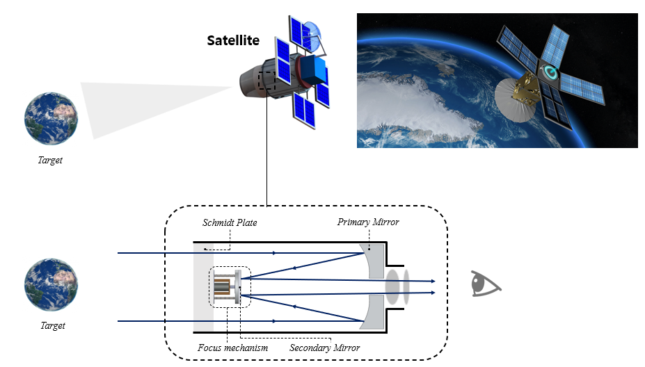
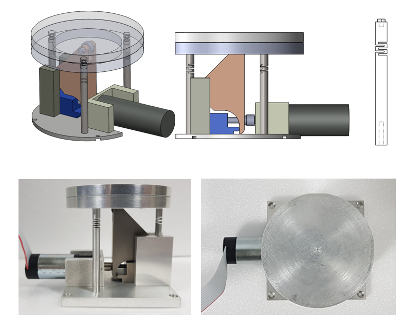
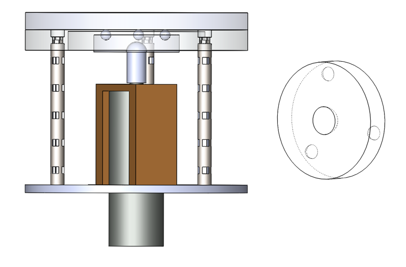
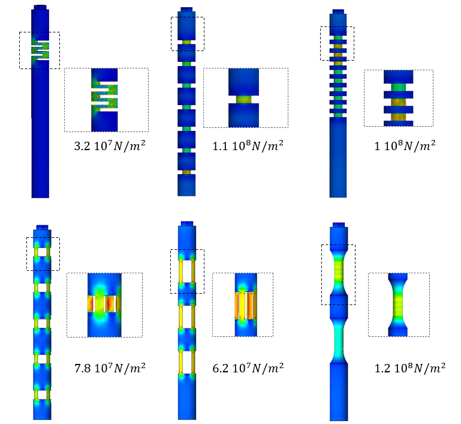

<h1 style="text-align:center; margin-top:20px;">
  Small Satellite Optical Systems
</h1>

  <!-- The image -->
  

  <!-- Caption BELOW the image -->

  ...

<!-- 3‑image row -->

  <!-- Image 1 -->
  

    
    

   
    

  

  <!-- Image 2 -->
  

    
    

 
    

  

  <!-- Image 3 -->
  

    
    

 
    

  

    Design - Fabrication - Experiment

  

  ...

## Overview

The Small Satellite Mirror Flexure Holder (SMFH) was developed to correct optical misalignment in a compact Schmidt–Cassegrain telescope. I designed a compliant flexure structure with radial slits to provide high bending stiffness while maintaining controlled axial motion. Through structural simulation and experimental testing, a five‑slit FlexHe design was identified as optimal. The system integrates three FlexHes driven by a single geared motor, enabling precise De‑space, De‑center, and tilt adjustments without external sensors. The prototype achieved sub‑micron control resolution and met optical alignment requirements, demonstrating a lightweight, low‑power, and mechanically simple solution suitable for small satellite payloads.

