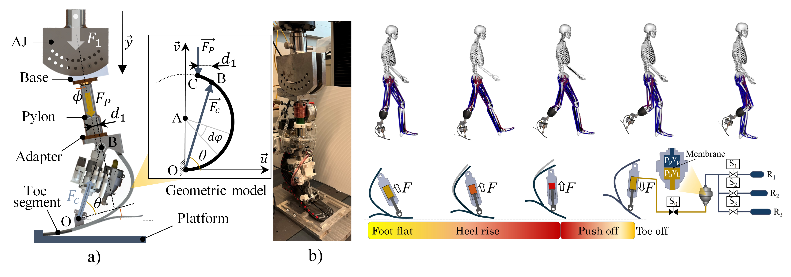

<h1 style="text-align:center; margin-top:20px;">
    Semi‑Active Ankle‑Foot Prosthesis Using a Pneumatic–Hydraulic Hybrid for Stiffness and Energy Timing Control 
  <a href="https://ieeexplore.ieee.org/stamp/stamp.jsp?tp=&arnumber=11063036" target="_blank" style="font-size:18px; margin-left:10px;">
    [Article]
  </a>
</h1>

## Role

Lead designer and system developer — responsible for mechanical design of the hybrid pneumatic–hydraulic ankle joint, stiffness‑modulation strategy, gait‑phase timing control, embedded sensing, and full benchtop and human‑in‑the‑loop validation.

---
## Working Principle

During early to mid‑stance, body weight deforms the carbon‑fiber blade (CFB), pushing the hydraulic piston and forcing oil into the accumulator. The displaced oil compresses the pneumatic chamber through a membrane, converting external load into stored pneumatic energy. By opening or closing pneumatic valves (S1–S3), the effective air volume changes, allowing the prosthesis to adjust stiffness in real time.

At peak dorsiflexion, the hydraulic valve closes to hold the CFB deformation using the incompressibility of fluid. When the valve reopens, the stored hydraulic and pneumatic energy is released, generating push‑off assistance during terminal stance. This cycle repeats every gait step, enabling stiffness modulation and timed energy return without active motors.

## Innovation

The PHHP introduces a compact pneumatic–hydraulic hybrid architecture that enables both variable stiffness and controlled energy‑return timing — capabilities not simultaneously achieved in existing passive or quasi‑active prostheses. Unlike systems that rely on large motors or bulky hydraulic cylinders, the PHHP uses:
- three pneumatic chambers for stiffness modulation,
- a hydraulic cylinder for energy capture,
- a timing valve for controlled push‑off release,
- and a membrane‑based accumulator for energy transfer.

This design fully leverages the energy stored in the carbon‑fiber blade while maintaining low power consumption and compact form factor.

## Mechanical Architecture

The PHHP consists of four major subsystems:

1. <b>Carbon Fiber Blade (CFB):</b> Provides baseline stiffness and stores deformation energy. Modified to reduce profile height and integrate with the hydraulic cylinder.

2. <b>Hydraulic System:</b> Includes a Festo DSNU‑32‑20‑P cylinder, accumulator, and hydraulic valve (S0). Captures CFB deformation energy and releases it at the desired timing.

3. <b>Pneumatic System:</b> Three pneumatic chambers (R1–R3) with solenoid valves (S1–S3) adjust stiffness by changing effective air volume. Includes pressure and linear displacement sensors.

4. <b>Accumulator:</b> A membrane‑based chamber that couples hydraulic and pneumatic subsystems, enabling energy transfer between fluid and air volumes.

The full system fits within L28 × H24 × W8 cm and weighs 2.7 kg.

## Experimental Setup

Two experiments were conducted:

1. <b>Energy‑Return Timing Test:</b> The prosthesis was set to 15° dorsiflexion to evaluate the hydraulic valve’s ability to hold and release stored CFB energy. The valve successfully held deformation for ~0.4 s, demonstrating feasibility for late‑stance push‑off timing.

2. <b>Variable Stiffness Test:</b> A universal testing machine applied 950 N at dorsiflexion angles of 0°, 5°, 10°, and 15°. Four pneumatic configurations (Open All, Close 1, Close 1‑2, Close 1‑2‑3) were tested under 100 kPa and 200 kPa pre‑charge pressures. Stiffness values were extracted from force–displacement curves.

## Results Summary

The hydraulic valve successfully delayed energy release, holding the CFB for ~0.4 s before push‑off — sufficient for the 50–60% gait cycle window. Variable stiffness ranged from 24.3 to 54 N/mm depending on pneumatic configuration and pre‑charge pressure. Stiffness increased with higher pre‑charge pressure and decreased with larger dorsiflexion angles. The PHHP achieved 72–84% energy‑return efficiency during forefoot loading, demonstrating effective energy storage and release.

  
  

    Overall system
  

  <!-- Left video -->
  

    <video width="100%" controls style="border-radius:10px;">
      <source src="assets/Passive.mp4" type="video/mp4">
    </video>
    

      Working principle of the system
    

  

  <!-- Right video -->
  

    <video width="100%" controls style="border-radius:10px;">
      <source src="assets/Ve1_1.mp4" type="video/mp4">
    </video>
    

      Bench testing of prosthesis
    

  

<video width="100%" controls style="border-radius:10px;">
  <source src="assets/Nguyen_prosthesis.mp4" type="video/mp4">
</video>
    

      Human experiments
    

## Experiment Links
- 🔗 <a href="https://www.youtube.com/watch?v=-Jwi2hzbVOI" target="_blank"> Experiment on Semi Active Prosthesis </a>

