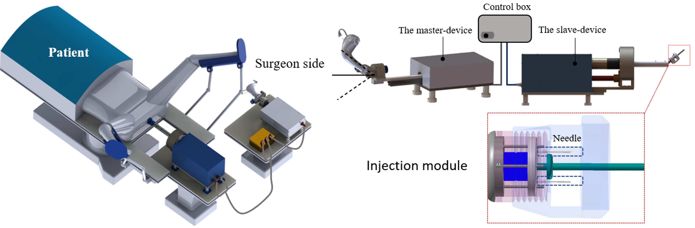
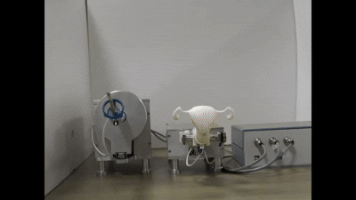

<h1 style="text-align:center; margin-top:20px;">
   Master–Slave Uterine Manipulation Robot System for Laparoscopic Hysterectomy
  <a href="https://asmedigitalcollection.asme.org/mechanismsrobotics/article/15/2/021001/1141068/Three-Degrees-of-Freedom-Based-Master-Slave" target="_blank" style="font-size:18px; margin-left:10px;">
    [Article]
  </a>
</h1>

## Role
Lead designer and system developer — responsible for mechanical design of the master–slave robotic platform, actuation and sensing integration, control algorithm development, and experimental validation using anatomical models.

## Overview

This project presents a three‑degree‑of‑freedom master–slave robotic system designed to improve uterine manipulation during laparoscopic hysterectomy. The system enables surgeons to control uterine positioning directly through a master interface, reducing dependence on an assistant and minimizing variability caused by manual operation. The slave robot provides stable, precise, and repeatable motion, allowing consistent visualization of anatomical structures throughout the procedure.

The platform integrates an intuitive master console, a multi‑DOF slave manipulator, embedded force and position sensing, and real‑time control algorithms that ensure smooth and safe actuation. Bench‑top and anatomical‑model experiments demonstrated high positional accuracy, reliable force transmission, and improved control consistency compared to conventional manual uterine manipulators.

  

  
  

    The master–slave uterine manipulation robot
  

  
  

    The manufactured UMaRo system and master–slave motion
  

  
  

    Experiment 
  

## Experiment 
- 🔗 <a href="https://youtu.be/YZCKeSqud9I" target="_blank"> Experiment 1 </a>  
- 🔗 <a href="https://www.youtube.com/watch?v=VB54egLQEzg" target="_blank"> Experiment 2 </a> 

